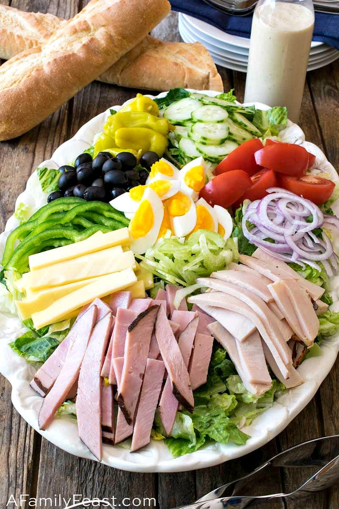

---
# Chef Salad
>
>
>
---

## Interview Questions 
> 1. What primary components are needed to prepare a chef's salad? 
> 1. Should I chop the lettuce or leave it whole? 
> 1. Is it better to have the meat cooked or raw? 
> 1. Do you prefer grating or cubing the cheese? 
> 1. What kind of dressing, and how much, should be applied? 
> 1. Should you serve the salad in a bowl or on a plate? 
> 1. What kind of lettuce should the preferred variety use? 
> 1. Do the vegetables need to be sliced or diced? 
> 1. Should there be any other sides or condiments provided with the salad? 
> 1. Are there any dietary preferences or limits that need to be considered?

---
## [Go Back to Home Page](./)
---
