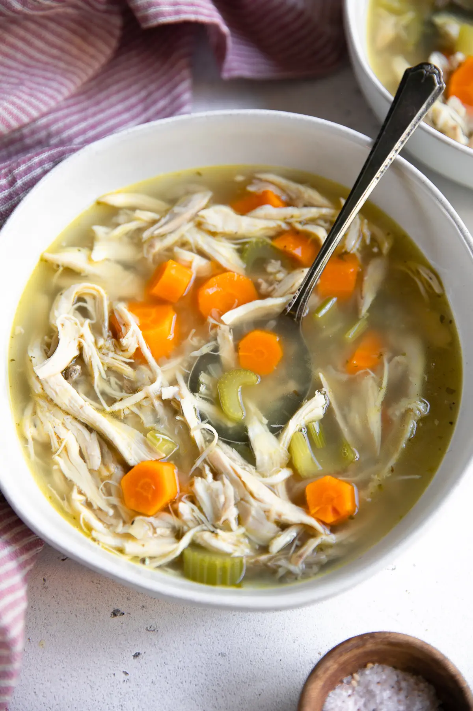

---
# Chicken Soup
>
>
>
---

## Interview Questions 
> 1. What are the key components needed to create chicken soup? 
> 1. Should the chicken be cooked in the soup or first? 
> 1. What kind of vegetables, and how much of each, should be added to the soup? 
> 1. Should the soup be flavored with herbs, spices, or both? 
> 1. Is it proper to serve the soup hot or cold? 
> 1. How long should the soup cook before it is served?  
> 1. Is there a particular cut of chicken to use, such the breast or the thigh? 
> 1. Should the soup be pureed or left in chunks? 
> 1. Should there be any additional sides or condiments provided with the soup? 
> 1. Are there any food restrictions or preferences that need to be considered?

---
## [Go Back to Home Page](./)
---
