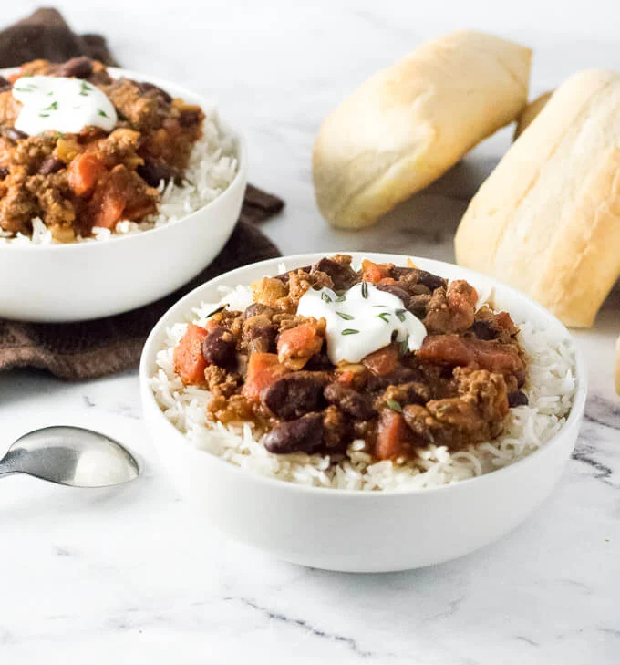

---
# Chili and Rice 
>
>
>
---

## Interview Questions 

> 1. What primary components are needed to make rice and chili? 
> 1. Should the chili be made with beef, turkey, or other meat? 
> 1. What number of different bean varieties should be included in the chili? 
> 1. In terms of spice, should the chili be mild, medium, or hot? 
> 1. What kind of rice should be used, and how should it cook? 
> 1. Should rice and chili be served separately or together? 
> 1. Is there a specific cheese that is liked to use as a topping? 
> 1. Should the chili be prepared on the stove or in a slow cooker? 
> 1. Does the consistency of the chili have to be thick or more soup-like? 
> 1. Are there any dietary preferences or limits that need to be considered?

---
## [Go Back to Home Page](./)
---
