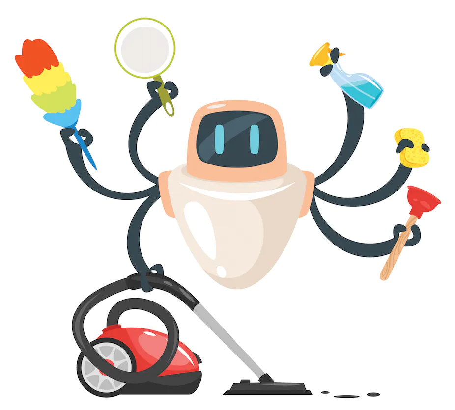

<h1 align="center">Home</h1>

>
> 
> Welcome to our website, and thank you for your interest in the RoboTasker 5000, our newest offering (RT5000). The RT5000 is a programmable robot made to assist families with common household tasks. It can carry out multiple physical chores that a human can thanks to its arms and wheels, making it the perfect assistant for busy families.
> Users can set the RT5000 to perform an array of household tasks using an app that controls it. A touchscreen located on the top of the robot's head allows users to customize the task by input different features. Users can customize how to clean different rooms in their house or schedule the robot to begin a cleaning duty at a specified time, for instance.

---
---

<h1 align="center">Documentation Requirements </h1>

## Interview Questions 

| *Recipe*   | *Interview Questions*   | 
|:-------------|:------------------|
| **Tuna Fish Sandwich** | [Link to another page](TunaSandwich.html) | 
| **Chicken Soup**| [Link to another page](ChickenSoup.html)| 
| **Chili and Rice** | [Link to another page](ChiliRice.html) | 
| **Chef Salad**    | [Link to another page](ChefSalad.html)|

---
---

<h1 align="center">Trello User Stories </h1>

## [Go To Trello User Stories](UserStories.md)
---

---

<h1 align="center">Top 10 List of Requirements  </h1>

---
> 1. **I should be able to choose the recipe for Chicken Soup, Chili and Rice, Tuna Sandwich, and Chef Salad, as well as the preferred presentation method using an app on the RT5000.**
> 1. **A built-in timer on the RT5000 needs to notify me when the meal is prepared.**
> 1. **I should be capable to choose from a list of possibilities that the RT5000 can generate using a database of ingredients that it has access to.**
> 1. **A variety of quality spices and seasonings from the RT5000 should be included in the meal to improve the flavor.**
> 1. **The touchscreen interface of the RT5000 should be simple to use and navigate.**
> 1. **To quickly and efficiently chop vegetables and other elements for the salad, the RT5000 should have a set of sharp blades and cutting boards.**
> 1. **The voice assistant on the RT5000 should be able to direct me through the cooking process and respond to any queries I might have.**
> 1. **A variety of quality spices and seasonings from the RT5000 should be included in the meal to improve the flavor.**
> 1. **To guarantee that the soup is cooked correctly and completely, the RT5000 should come equipped with high-quality cooking utensils and tools.**
> 1. **An app that offers step-by-step directions for preparing the chili and rice dish should be available for the RT5000.**

*With these requirements, the RT5000 meal prep can help you cook delicious and healthy meals with ease and convenience. Bon appetit*
---

<h1 align="center">User Interface Wireframes </h1>

## [Go Here](UserStories.md)

---
---
<h1 align="center">Credits </h1>

## Members 

### [Brix Lopez](https://www.linkedin.com/in/brixlopez/)
### [Feven Haile](https://www.linkedin.com/in/feven-haile-a80669261/)

## Trello Workspace 
### [User Stories Board](https://trello.com/b/1iHTwr1O/user-story-requirements)

## Github 
### [Repository](https://github.com/BrixLopez/RoboTasker5000)

### [WebPage](https://brixlopez.github.io/RoboTasker5000/)

