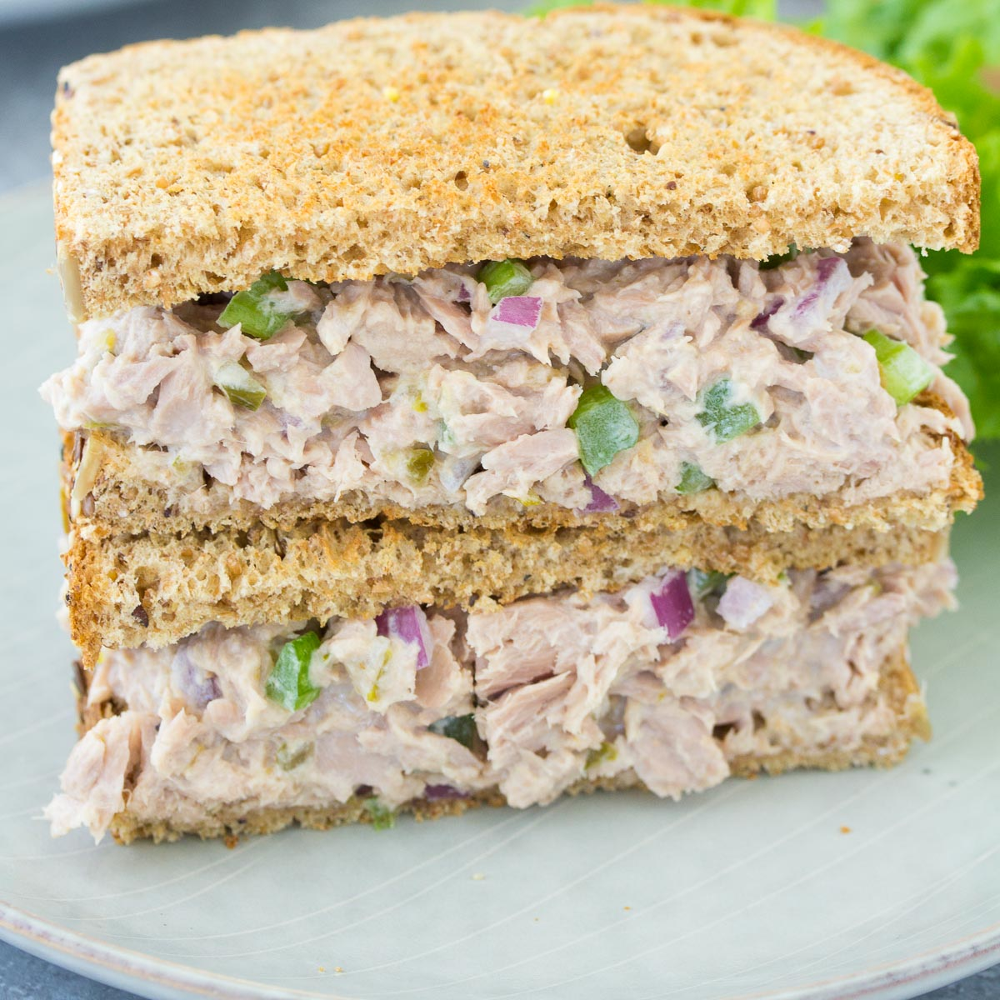

---
# Tuna Fish Sandwich
>
>
>
---

## Interview Questions 

> 1. What ingredients go into making a sandwich using tuna fish? 
> 1. What kind of bread works best for a tuna fish sandwich? 
> 1. What quantity of mayonnaise should be added to the tuna fish? 
> 1. How do you cut the lettuce and tomato for the sandwich? 
> 1. Should the bread be toasted for how long? 
> 1. What sort of cheese if any is suggested for use? 
> 1. Is it better to cut the sandwich diagonally or in half? 
> 1. Is there a particular way to put the sandwich's ingredients in order? 
> 1. Is the sandwich served with any additional sides or condiments that could be available? 
> 1. Do we need to be mindful of any dietary preferences or restrictions?

## [Go Back to Home Page](./)
